# System-Thinking Team Solution For Tourist App

[](https://travis-ci.org/DGKmaster/system-thinking)

## Описание

Приложение и сервер по созданию туристических маршрутов.

---

## Технологический стек

1. Java 11
1. Spring MVC
1. Tomcat 9
1. Docker 18.09
1. PostgreSQL
1. Travis CI

---

## Взаимодействие между приложением и сервером

### Запрос

#### Параметры

* **time** - Максимальная временная продолжительность маршрута.
* **money** - Максимальный бюджет.
* **type** - Тип маршрута.
  * active - активный (парки, ).
  * passive - пассивный (кино, театр).
  * education - образовательный (музеи, ).
* **mycoordD** - Текущее положение пользователя (долгота).
* **mycoordS** - Текущее положение пользователя (широта).
* **sortby** - Сортировка предлагаемых маргрутов.
  * rating - Сортировка по рейтингу.
  * time - Сортировка по продолжительности.
  * prices - Сортировка по стоимости.
* **page** - Страница поисковой выдачи.

#### Пример

```url
http://localhost:8080/server/?time=60&money=1000&type=active&mycoordD=60.037&mycoordS=37.75&sortby=rating&page=1
```

### Ответ

#### Параметры ответа

* **title** - Название маршрута
* **placesNumber** - Количество достопримечательностей
* **description** - Описание маршрута
* **time** - Продолжительность маршрута
* **rating** - Рейтинг маршрута
* **Array[] locations** - Список достопримечательностей
  * **title** - Название достопримечательности
  * **coordD** - Местоположение достопримечательности (долгота)
  * **coordS** - Местоположение достопримечательности (широта)
  * **desctiption** - Описание достопримечательности
  * **imgURL** - Фотография достопримечательности
  * **rating** - Рейтинг достопримечательности
  * **id_place** - Идентификационный номер достопримечательности

#### Пример ответа

```json
{
    "title": "foo",
    "placesNumber": 5,
    "description": [1, 2, 3],
    "time": [1, 2, 3],
    "rating": [1, 2, 3],
    "locations": [
        {
            "title": "dfdf",
            "coordD": "dfdf",
            "desctiption": "dfdf",
            "imgURL": "dfdf",
            "rating": "dfdf",
            "id_place": "dfdf",
        },
        {
            "title": "dfdf",
            "coordD": "dfdf",
            "desctiption": "dfdf",
            "imgURL": "dfdf",
            "rating": "dfdf",
            "id_place": "dfdf",
        }
    ]
}
```

---

## Интерфейс приложения

### 1. Главное окно

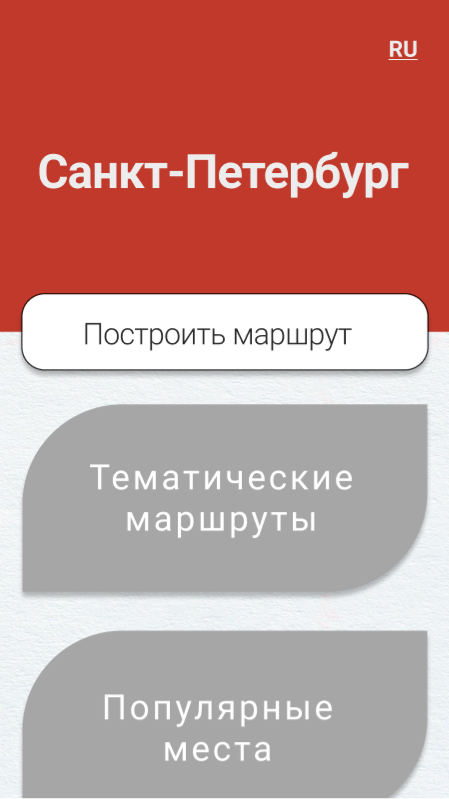

---

### 2. Построение маршрута

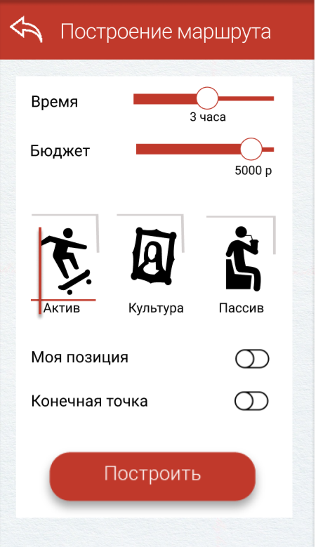

---

### 3. Выбор маршрута

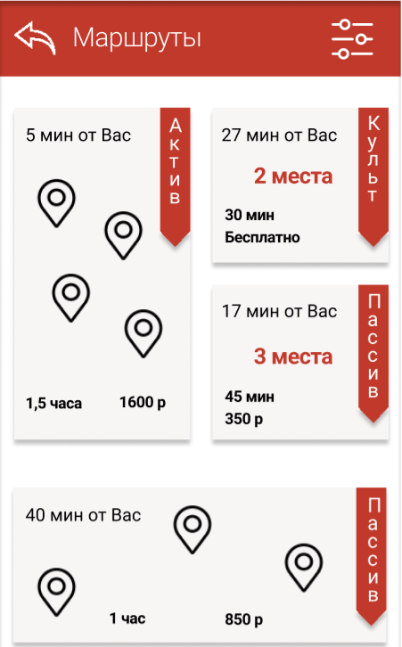

---

### 4. Описание маршрута

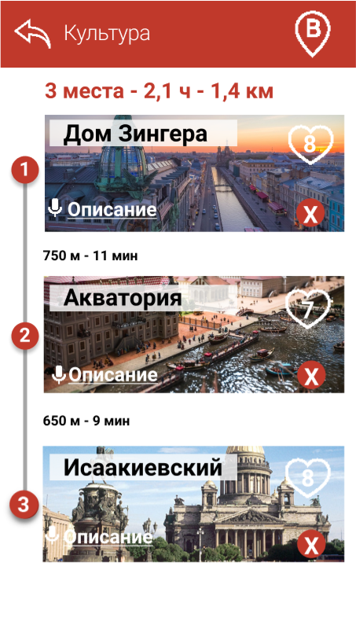

---

### 5. Карта маршрута

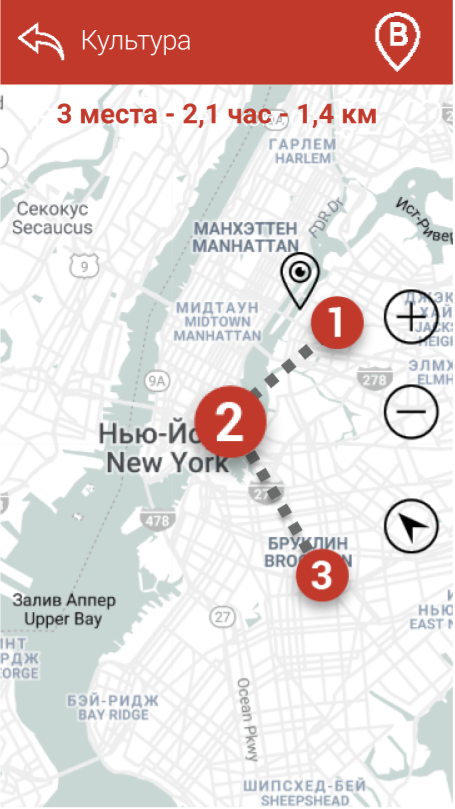

---

### 6. Дополнительная информация по маршруту

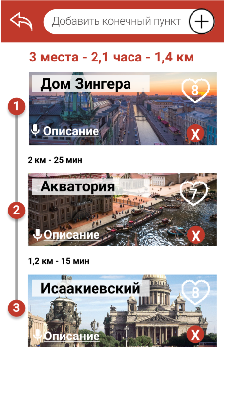

---

### 7. Вывод цены маршрута

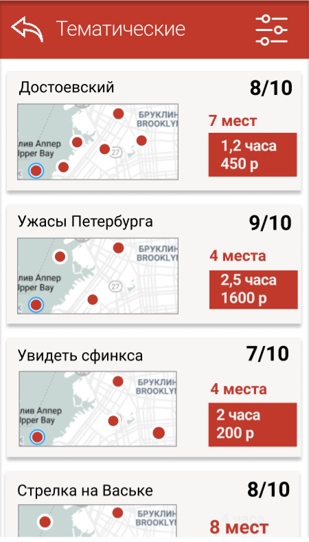

---

### 8. Вывод продолжительности маршрута

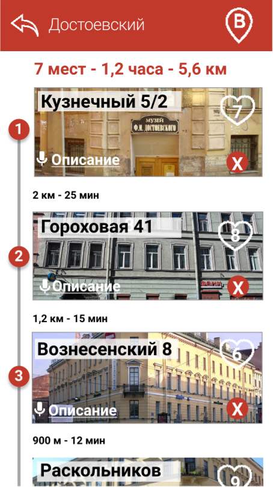

---

### 9. Окно

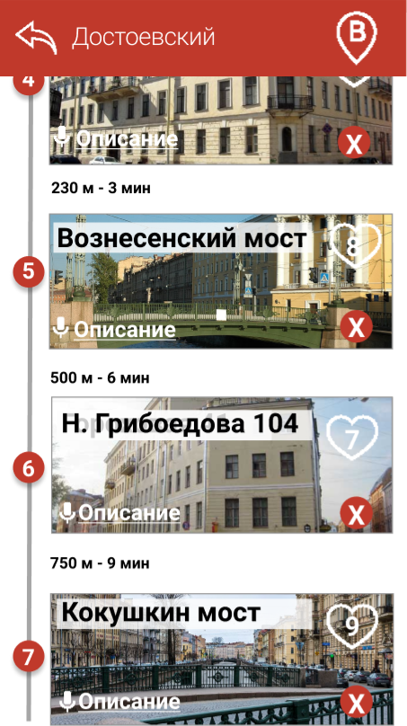

---

### 10. Окно

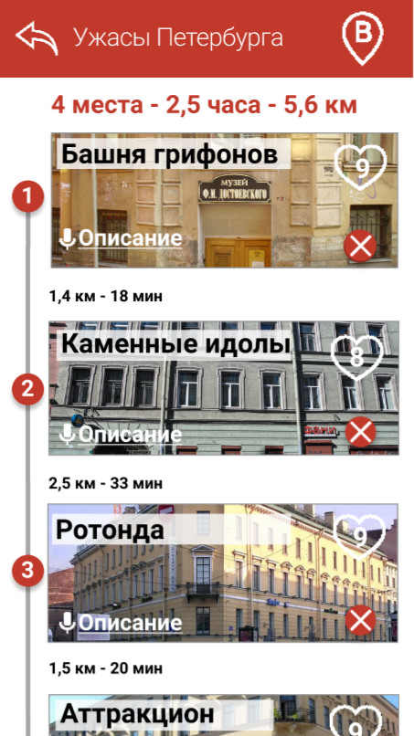

---

### 11. Окно


---

### 12. Окно

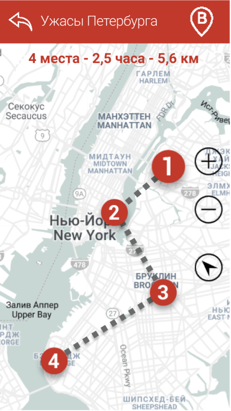

---

### 13. Окно

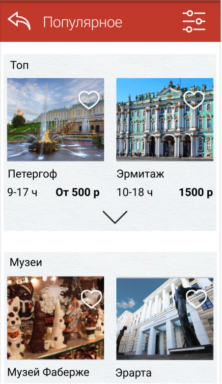

---

### 14. Окно

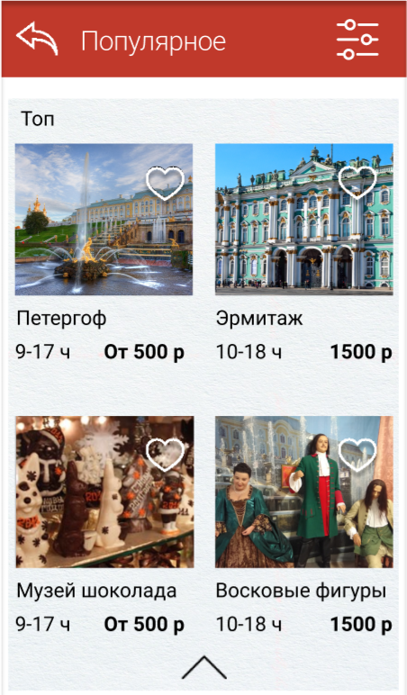

---

### 15. Окно

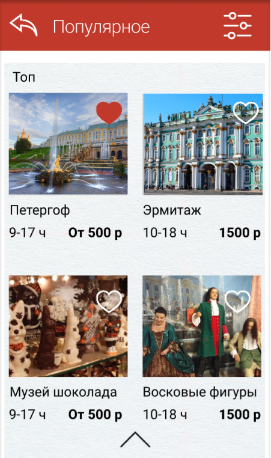

---

### 16. Окно

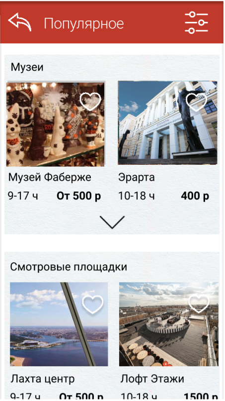

---
